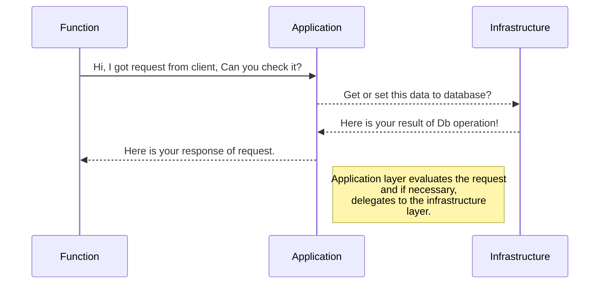

# FLIGHT ANALYSIS APPLICATION!

Our goal with these techniques is to develop code that is more readable and testable. A new architecture was developed using a multi-layer structure and domain-driven design (**DDD**). Code-first migration was employed to create the database, and Entity Framework was used as the Object-Relational Mapping (**ORM**) tool. The architecture aims for loose coupling and high cohesion. To achieve this, Dependency Injection (**DI**) has been adopted, and each service is designed to be responsible only for its specific concern. Another benefit of this loosely coupled architecture is the integration of the MediatR pattern, enabling requests to be passed to their designated handlers efficiently.

# Project Structure

```
/FlightDataAnalysis
 ├── Domain
 │   ├── Abstract
 │   └── Aggregation
 │       ├── AirCrafts
 │       ├── Airports
 │       └── Flights
 │   ├── Common

 ├── Application
 │   ├── Common
 │   ├── Services
 │   ├── UseCases
 │   │   └── FlightData
 │   └── Validations

 ├── Infrastructure
 │   ├── Config
 │   ├── Migrations
 │   └── Repositories

 ├── Function
 │   ├── Attributes
 │   ├── Functions
 │   └── Middlewares

 ├── Test
 │   ├── ApplicationUnitTests
 │   ├── FunctionalTests
 │   └── InfrastructureIntegrationTest
```

## Technologies Used

* C# with .NET 8 and Azure Function V4
* Entity Framework Core (Code First)
* Azure Functions
* MediatR
* FluentValidation
* Swagger / OpenAPI
* XUnit for Testing
* JetBrains Rider IDE

# Domain Layer

This layer contains domain entities such as "Aircraft" and "Flight." Each domain entity corresponds to a table in the database. Additionally, repository interfaces are defined in this layer for **DI**. For example, if there is a repository to access flight data like "FlightRepository," its interface must be defined within the Domain Layer. Since all layers can reference the Domain Layer—but the Domain Layer should not reference any other layer—this ensures flexibility in accessing interfaces via **DI**.

# Application Layer

In the Application Layer, Data Transfer Objects (**DTOs**), MediatR requests, and their corresponding handlers are defined. Each request has a unique handler, promoting a clear separation of concerns. This layer acts as the business layer, handling logic such as sending emails, data validation, and responses. While other layers perform specific roles, the Application Layer coordinates and orchestrates all actions.

## CQRS Pattern

The project loosely adheres to the CQRS pattern by separating read and write operations using MediatR. Each request is processed by an `IRequestHandler<TRequest, TResponse>`, enhancing both testability and maintainability.

**FluentValidation:** FluentValidation is utilized to validate incoming input parameters from clients. All validation logic should be placed within this layer. Here is an example:

```
public class PaginationValidator: AbstractValidator<Pagination>
{
    public PaginationValidator()
    {
        RuleFor(x => x.Page)
            .GreaterThan(0)
            .WithMessage("Page must be greater than 0");

        RuleFor(x => x.PageSize)
            .GreaterThan(0)
            .WithMessage("PageSize must be greater than 0");

        RuleFor(x => x.PageSize)
            .LessThanOrEqualTo(100)
            .WithMessage("PageSize must be less than 100");
    }
}
```

# Function Layer

This layer receives client requests and forwards them to the Application Layer via MediatR. Time-triggered functions also reside here. OpenAPI (Swagger) is used to describe each function's request and response schema.

```
    [OpenApiOperation("GetFlightDataFunction")]
    [OpenApiRequestBody("application/json", typeof(Pagination))]
    [OpenApiResponseWithBody(HttpStatusCode.OK, "application/json", typeof(FlightDto[]))]
```

*The code above illustrates a function definition in OpenAPI. This function takes `Pagination` as input and returns an array of `FlightDto`.*

To enable request payload validation, the `ValidateRequest` attribute is used:

```csharp
[ValidateRequest(typeof(Pagination))]
```

Middleware components such as **ExceptionHandlerMiddleware** and **ValidationMiddleware** are also applied in this layer.

# Infrastructure Layer

This layer handles all database operations such as saving, deleting, and retrieving data. Database configuration is managed here using the `IEntityTypeConfiguration` interface. Entities created in the Domain Layer are configured here.

Example:

```
public class FlightConfiguration : IEntityTypeConfiguration<Flight>
{
    public void Configure(EntityTypeBuilder<Flight> builder)
    {
        builder.Property(e => e.FlightNumber)
            .IsUnicode(false)
            .HasMaxLength(10);

        builder.HasOne(e => e.AirCraft)
            .WithMany()
            .HasForeignKey(e => e.AirCraftId)
            .IsRequired();

        builder.HasOne(e => e.DepartureAirport)
            .WithMany()
            .HasForeignKey(e => e.DepartureAirportId)
            .IsRequired();

        builder.HasOne(e => e.ArrivalAirport)
            .WithMany()
            .HasForeignKey(e => e.ArrivalAirportId)
            .IsRequired();
    }
}
```

This example shows how the Flight entity is configured with constraints such as foreign keys and property length. These configurations are reflected when a migration is applied using EF Core.

The context class is central to this layer. All database entity configurations should be defined here. This class is used extensively for accessing data.

## Migration

To reflect changes in the database—like adding or removing tables or columns—you need to modify the entities and run EF CLI commands:

```
dotnet ef migrations add "ChangeProperty" --startup-project Function --project Infrastructure --context Context

dotnet ef database update --startup-project Function --project Infrastructure --context Context

dotnet ef migrations remove --startup-project Function --project Infrastructure --context Context
```

# Test

Unit tests and integration tests are implemented using XUnit. All code should be testable. Following Test-Driven Development (TDD), tests should be written before code implementation. The red-green-refactor cycle is encouraged.

Where possible, unit tests are preferred. Integration and functional (end-to-end) tests follow as needed.

# Preferred IDE

JetBrains Rider was used during development. Though not required, it can be accessed here:
[https://www.jetbrains.com/rider/](https://www.jetbrains.com/rider/)

## UML diagrams

Below is a UML sequence diagram that helps illustrate the architecture:



# Configuration

Application secrets like the connection string are stored in `local.settings.json` to simplify development. This file is included in version control.

## Keywords

**DDD**: Domain-Driven Design

**DI**: Dependency Injection

**ORM**: Object-Relational Mapping

**DTO**: Data Transfer Object


Happy Coding...
